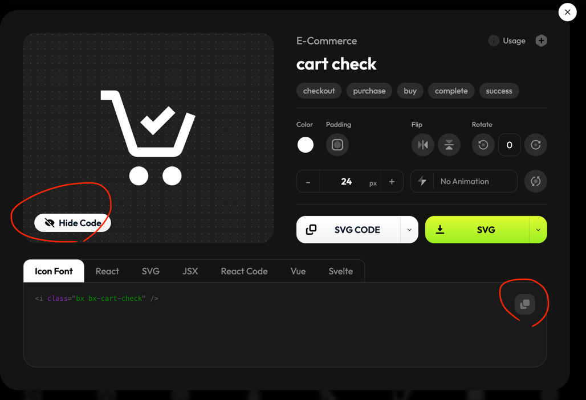

# boxicon 가이드

1. layout.tsx cdn 추가

```aiignore
      <head>
	      <link href="https://cdn.boxicons.com/3.0.8/fonts/basic/boxicons.min.css" rel="stylesheet"/>
	      <link href="https://cdn.boxicons.com/3.0.8/fonts/filled/boxicons-filled.min.css" rel="stylesheet"/>
	      <link href="https://cdn.boxicons.com/3.0.8/fonts/brands/boxicons-brands.min.css" rel="stylesheet"/>
      </head>
```

2. 사용

```aiignore
			<i className="bx bx-volleyball"></i>
			<i className="bxf bx-volleyball"></i>
			<i className="bxl bx-twitter"></i>
```

3. 레퍼런스 링크

```aiignore
https://boxicons.com/icons/cart-check?free=true
```


